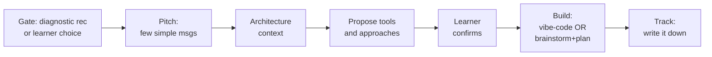

# Block Runtime Pattern

> **Status: soft direction, not canonical.** This 6-step sketch predates the thinner multi-phase body shape that shipped skills now run. Use this doc as a thesis on simplicity-and-friction-reduction philosophy, not as the operational phase template.

## Thesis

All MVP blocks except the Diagnostic should keep the block machinery thin (pitch → architecture context → propose → confirm → build → track is the original sketch), so the content can iterate toward a faster aha moment. Treat the six steps as a lens on simplicity, not as a hard phase count.

## Overview

This document captures the original runtime intent for POS course blocks (except `/pos` Diagnostic). It is distinct from the authoring template in `block-creation-template.md` — the template says how to write a block; this document says how a block was originally meant to run. §1 defines the gate that controls when a learner reaches a block, §2 specifies the step-by-step runtime flow, §3 records the content iteration philosophy that governs how blocks evolve over time, and §4 lists external references to cross-check this pattern against. For the current normative body shape, see `docs/skill-contract.md`.

**Primary source:** User directive from Stanislav Fedoseev during the 2026-04-11 work session on the `pos-blocks` tool build. Captured verbatim from conversation and structured into sections here.

**Block Runtime Flow (Occurrent - LR):**

## 1.0 Gate

¶1 A block never runs unconditionally. The learner reaches it only when the Diagnostic recommends it, or when the learner actively chooses to open it. This is the principle that keeps the course personalized and prevents irrelevant blocks from cluttering the experience.

## 2.0 Runtime flow

¶1 **Ordering principle:** the six steps below run in strict order because each step sets up the decision that follows — context first, then a concrete proposal, then consent, then execution.

¶2 **Pitch (a few simple messages):** the block opens by explaining in plain language what it will help the learner create. No architecture front-loading, no jargon — the goal is to set the scene and earn buy-in.

¶3 **Architecture context:** the block tells the learner what is already in place based on the current state of their personal architecture tracking — what prior blocks have produced, what is still missing. This answers "where am I in the system?" without requiring the learner to re-read any docs.

¶4 **Propose tools and approaches:** the block offers the specific instruments and approaches the learner will use. Options, not instructions.

¶5 **Learner confirms or corrects:** the consent gate. Nothing is built until the learner has accepted (or edited) the proposal.

¶6 **Build:** once approved, the block drops into one of two modes:
  - **Vibe-code mode** — fast iterative build, suitable for blocks that are essentially code generation plus light configuration.
  - **Brainstorm + plan + extract-data mode** — for blocks that need data work or multi-step design before any code is written.

The choice of mode is a property of the block itself, not a runtime decision.

¶7 **Track:** when the build is done, the block writes the outcome to the learner's state and marks the block complete.

## 3.0 Content iteration philosophy

¶1 **Simple blocks, great content.** The block machinery is intentionally thin. The value of each block lives in the content — the wording of the pitch, the clarity of the architecture summary, the specificity of the proposed tools.

¶2 **Start draft, iterate toward friction reduction.** First pass is rough draft content. Every subsequent pass should make the block easier to understand and faster to get the learner to the aha moment. The target of iteration is friction reduction, not feature addition.

## 4.0 Cross-checks

¶1 **Claude Code for Project Managers** — Stas wants to verify whether this runtime pattern matches what's already used in that course/reference. Pending check; to be done before authoring the first MVP block content. **Source:** user's own note in the same 2026-04-11 directive.
